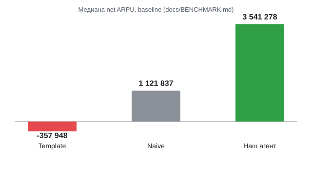

# Агент управления тарифными кампаниями Beeline

На seed 42 в мок-среде замороженный код `f11ae2d` даёт чистый результат **3 170 330 у.е.**



## Быстрая проверка

После установки зависимостей:

```bash
python local_eval.py
python local_eval.py --runs 10
python -m pytest tests/ -v
```

## Быстрый старт

Из корня репозитория:

```bash
python3 -m venv .venv && source .venv/bin/activate && pip install -r requirements.txt
python local_eval.py
python make_submission.py
```

Чистый результат на seed 42 (мок-среда): **3 170 330 у.е.**, 20 пилотов, 10 финальных кампаний — замороженный код `f11ae2d`, см. [docs/PLAN_EXAMPLE.md](docs/PLAN_EXAMPLE.md).

## Описание

Решение команды для Beeline Tariff Marketing Campaigns Case (см. `PARTICIPANT_GUIDE.md`): `Agent.act` в `agent.py` выбирает, какой ячейке аудитории «текущий тариф × ARPU-сегмент» предложить целевой тариф и через какой канал.
Агент исследует эффект переходов ограниченным числом пилотов и формирует до 10 финальных кампаний, стремясь максимизировать чистый прирост ARPU в пределах бюджета и охвата.
Пилоты проходят на самом дешёвом доступном слайсе ячейки (cheap-slice — с минимальным средним `predicted_arpu`, где хватает клиентов); результаты байесовски обновляют исходные оценки из истории переходов (см. [docs/PRIORS.md](docs/PRIORS.md)).
Перед обычной финальной кампанией действует gate подтверждения: в текущей policy `v4` и объединённая оценка по пилотам, и байесовская оценка эффекта должны быть положительными.
Опциональный LLM-советник в policy `v4` может только убрать часть финальных кампаний; он никогда не добавляет кампании и включается только при `AGENT_USE_LLM=1` вместе с непустым `OPENAI_API_KEY`.

## Текущие результаты

| Метрика | Значение | Источник |
|---|---|---|
| Чистый результат, seed 42 (`python local_eval.py`) | 3 170 330 у.е. (валовой прирост 3 270 248, затраты 99 918, ROI 32.73×) | [docs/PLAN_EXAMPLE.md](docs/PLAN_EXAMPLE.md), замороженный код `f11ae2d` (пример снят на `701015c`, код агента тот же) |
| Медиана по 10 прогонам (`python local_eval.py --runs 10`) | 3 541 278 у.е. (минимум 1 759 226) | [docs/BENCHMARK.md](docs/BENCHMARK.md), замороженный код `f11ae2d` |
| Устойчивость на стресс-тесте (6 вариантов × seeds 0–9, `tools/stress_eval.py`) | 60 из 60 прогонов в плюс (по вариантам: baseline 10/10, ×0.5 arpu 10/10, ×1.5 arpu 10/10, случайное ×U(0.5,1.5) 10/10, смена знака 20% 10/10, conversion×0.5 10/10) | [docs/ROBUSTNESS.md](docs/ROBUSTNESS.md), замороженный код `f11ae2d` |
| По сравнению с naive-стратегией (baseline-вариант) | naive: медиана 1 121 837 у.е. — ниже нашей медианы 3 541 278 | [docs/BENCHMARK.md](docs/BENCHMARK.md), замороженный код `f11ae2d` |
| По сравнению с template — базовым агентом организаторов (baseline-вариант) | template: медиана −357 948 у.е. (отрицательно) — ниже нашей медианы 3 541 278 | [docs/BENCHMARK.md](docs/BENCHMARK.md), замороженный код `f11ae2d` |
| Доля от oracle-плана с полной информацией (baseline-вариант) | 71,0% от медианы oracle-плана | [docs/BENCHMARK.md](docs/BENCHMARK.md), замороженный код `f11ae2d` |

Все метрики в таблице измерены на замороженном коде `f11ae2d` (см. источники в колонке).

## Подход

Аудитория делится на ячейки «текущий тариф × ARPU-сегмент»: эффект перехода зависит только от ячейки, целевого тарифа и канала, поэтому решения принимаются по ячейкам. Для каждой ячейки история переходов (`data/change_tariff.csv`) даёт одну цель — более дорогой тариф с наибольшим априорным эффектом; даунгрейды не рассматриваются. Подробнее об исходных оценках — в [docs/PRIORS.md](docs/PRIORS.md).

Десять самых ценных ячеек по произведению априорного эффекта, размера и среднего ARPU получают по одному SMS-пилоту на 150 клиентов на самом дешёвом доступном срезе: сигнал тот же, а риск денежных потерь меньше. Три лучшие пары «ячейка — цель» по наблюдённому эффекту пилотируются повторно на 200 клиентов — это защита от «проклятия победителя», когда удачный шум выглядит как эффект. Оставшиеся из 20 пилотов идут на разведку следующих по ценности ещё не проверенных ячеек.

Каждый пилот обновляет байесовскую оценку эффекта. В финал допускаются только пары, у которых положительны и оценка по пилотам, и итоговая оценка с учётом истории. Для них планировщик подбирает канал и число контактов по ожидаемому чистому приросту под лимитами: 15 000 контактов, 100 000 бюджета, 5 000 клиентов на кампанию и до 10 финальных кампаний; сегменты не пересекаются.

Если ни одна пара не прошла отбор, агент возвращает одну безопасную кампанию без контактов; любая ошибка внутри агента тоже приводит к этой безопасной кампании. LLM-советник включается только явно — флагом `AGENT_USE_LLM=1` при непустом `OPENAI_API_KEY` — и в policy v4 может только убирать кампании. Подробности реализации приведены в [описании архитектуры](docs/ARCHITECTURE.md).

<details>
<summary><h2>Ключевые находки и отличия</h2></summary>

### Что мы поняли из среды

Эффект перехода определяется только связкой «текущий тариф × ARPU-сегмент × целевой тариф × канал». `data_segment` и `call_segment` меняют состав аудитории, но не сам эффект. Шум пилота в единицах ratio одинаков для всех каналов; поскольку сигнал масштабируется через `conversion_multiplier`, пилот на дешёвом канале оценивает базовый эффект, который переносится на другие каналы пропорционально их множителям (с учётом верхнего ограничения `min(..., 1.0)` в формуле). Финальные кампании обрезаются до 5 000 абонентов с наименьшими ID, а не до лучших клиентов. Пилоты тоже входят в скоринг наравне с финальными кампаниями. Подробнее: [механика среды, §§1–3](docs/MECHANICS.md#1-the-effect-model-what-everything-is-built-on).

### Обоснование и аналоги

В uplift modeling задача состоит в том, чтобы выделить людей, на которых воздействие действительно меняет результат: группу *persuadables* можно побуждать к действию, а *do-not-disturb* группу лучше не трогать. В нашем кейсе переход, который снижает ожидаемый ARPU или невыгоден, играет роль такой do-not-disturb группы: рассылка ей может принести отрицательный эффект. Похожее разделение аудитории рассматривается на примере датасета uplift-эксперимента Orange Belgium ([Orange Belgium uplift dataset](https://arxiv.org/abs/2312.07206)).

Другой близкий подход — budgeted multi-armed bandits: система пробует варианты, обновляет оценки по наблюдениям и распределяет ограниченный бюджет между вариантами. Это описывает суть связки Explorer и Bayes в нашем решении: пилоты собирают свидетельства об эффекте, байесовское обновление уточняет оценки, а планировщик выбирает кампании с учётом ограничений ресурсов. Сходная постановка распределения бюджета с bandits исследована на примере Amazon ([Amazon, bandits for budget allocation](https://arxiv.org/abs/2409.00561)).

### Почему LLM может только убирать кампании, но не добавлять

LLM-советник ограничен уже сформированными решениями: `review_finals` может убрать кампании из переданного списка по имени, а `rank_confirmations` — переставить только уже отобранных нами кандидатов из топ-6. Он не создаёт новые варианты. В обычном отборе планировщик policy `v4` допускает финальную кампанию только для проверенной пилотами пары «ячейка — целевой тариф», у которой положительны и объединённая оценка по пилотам (без учёта истории), и байесовская posterior-оценка. (Выключенная альтернатива `POLICY = "v3"` использует более строгий gate: не менее двух пилотов и `mean − 1.5 × sd > 0`.) Если таких кампаний нет, в коде предусмотрена отдельная fallback-кампания, не задевающая ни одного клиента, так что это правило относится именно к обычному отбору. Разрешение LLM добавлять кампании позволило бы обойти gate для тарифа, канала или сегмента без соответствующего пилотного подтверждения. Ограничение советника удерживает его в роли фильтра и не даёт ему создавать такие неподтверждённые варианты.

### Пилоты на дешёвом слайсе ячейки

Как описано в подразделе [«Что мы поняли из среды»](#что-мы-поняли-из-среды), эффект в единицах ratio зависит только от связки «текущий тариф × ARPU-сегмент × целевой тариф × канал», а не от `data_segment` или `call_segment`. Поэтому при одинаковом числе клиентов пилот на любом data/call-слайсе ячейки даёт ту же статистическую информацию о базовом эффекте.

В [agent_core/explorer.py](agent_core/explorer.py) флаг `CHEAP_SLICE_PILOTS = True` сейчас включает выбор такого слайса методом `_cheapest_slice`. Метод перебирает слайсы отдельно по каждому из столбцов `SLICE_COLUMNS = ("data_segment", "call_segment")` и среди слайсов, где есть хотя бы `n` клиентов, выбирает тот, у которого средний `predicted_arpu` минимален. Пилот получает один дополнительный фильтр — по `data_segment` или `call_segment`. Если подходящего слайса нет или флаг выключен, дополнительный фильтр не применяется. Так агент получает то же знание об эффекте с меньшей реальной денежной потерей, если проверяемая рука (arm) окажется отрицательной.

</details>

## Архитектура

Сервиса/бэкенда/фронтенда нет: скрипт запускает агента против симулированной
среды и печатает результат. Без опционального LLM-советника запуск целиком офлайн.

Цикл агента от истории переходов до плана кампаний:

```mermaid
flowchart TD
    A[Agent.act(env)] --> B[safety net: try/except вокруг _act]
    B --> C[Подключить priors_history.get_prior]
    C --> D[build_cells: ячейки tariff × arpu_segment]
    D --> E[ExplorerV4.candidates: одна upsell-цель на ячейку, ранг prior × size × ARPU]
    E --> F[Раунд 1: топ-10 ячеек, sms n=150, самый дешёвый срез]
    F --> G[Подтверждение: топ-3 по наблюдённому ratio, n=200, до 5 пилотов]
    G --> H[Остаток пилотов: скрининг следующих неисследованных ячеек, n=150]
    H --> I[PlannerV4.qualifying: pooled pilot > 0 и posterior mean > 0]
    I --> J[Канал и размер по экономике планировщика; лимиты reach/money/5000/10]
    J --> K{Есть кампании?}
    K -->|да| L[Вернуть до 10 кампаний, по одной на ячейку]
    K -->|нет| M[Fallback: кампания, не задевающая никого]
    L --> N{AGENT_USE_LLM=1 и ключ?}
    M --> N
    N -->|да| O[review_finals: может только удалить]
    N -->|нет| P[Вернуть список]
```

```
local_eval.py / make_submission.py
        │
        ▼
mock_environment.py  (локальный мок; на судействе его код не используется —
        │              environment.py тот же, но с реальной моделью эффектов)
        ▼
environment.py        — механика пилотов: шум, лимиты, история
        │
        ▼
agent.py  →  Agent.act(env)
        │
        ├─ agent_core/cells.py           — сборка ячеек аудитории
        ├─ agent_core/priors.py          — интерфейс априорного источника (pluggable)
        ├─ agent_core/priors_history.py  — источник априорных оценок из data/change_tariff.csv
        ├─ agent_core/bayes.py           — байесовское обновление по пилотам
        ├─ agent_core/explorer.py        — разведка: какие ячейки пилотировать
        ├─ agent_core/planner.py         — финальные кампании под лимиты
        ├─ agent_core/v4.py              — policy v4 (по умолчанию): ExplorerV4, PlannerV4
        └─ agent_core/llm_advisor.py     — опциональный LLM-советник с гардрейлами
        │
        ▼
scoring_core.py        — скоринг (тот же код, что у судей)
```

Файлы:

- `agent.py`, `agent_core/` — наш агент; `agent_core/v4.py` — используемая по
  умолчанию policy v4 (`agent.POLICY`), v3 в `explorer.py`/`planner.py` выключена.
- `agent_core/llm_advisor.py` — опциональный LLM-советник с гардрейлами;
  получает posterior и ограниченно влияет на порядок подтверждения и состав
  финального списка (см. [архитектуру](docs/ARCHITECTURE.md#llm_advisorpy)).
- `environment.py`, `scoring_core.py` — механика и скоринг от организаторов
  (не менять — на судействе используется этот же код).
- `mock_environment.py` — локальная заглушка эффектов для отладки.
- `local_eval.py` — локальный прогон агента на моке.
- `make_submission.py` — сборка `submission.csv` для сдачи.
- `data/`, `customer_profile.csv`, `feature_dictionary.csv`,
  `tariff_dictionary.csv` — данные от организаторов (аудитория, справочники).
- `agent_template.py` — исходный шаблон организаторов, оставлен для сверки.
- `tests/test_limits.py` — must-have лимиты; `tests/test_priors.py` — приоры;
  `tests/test_no_history.py` — работа без файла истории; `tests/test_hardening.py` —
  пустая аудитория, fallback без контактов, LLM opt-in и дедлайн;
  `tests/test_llm_advisor.py` — гардрейлы советника; `tests/test_bundle.py` —
  актуальность `dist/agent_single.py`.
- `tools/` — `stress_eval.py`, `benchmark.py`, `bundle_agent.py`, `explain_plan.py`,
  `scale_test.py`, `final_check.sh` (только проверки; агент их не импортирует).
- `docs/` — `ARCHITECTURE.md`, `MECHANICS.md`, `PRIORS.md`, `BENCHMARK.md`,
  `ROBUSTNESS.md`, `PLAN_EXAMPLE.md`, `LLM_RUNS.md`, `SCALE.md`, `RUN.md`,
  `JUDGE_CHECK.md`, `AUDIT.md`.
- `PARTICIPANT_GUIDE.md(.pdf)` — правила кейса от организаторов.

### Опциональные пункты ТЗ (§8)

| Пункт ТЗ §8 | Где реализовано | Подтверждение |
|---|---|---|
| Учёт неопределённости (не только среднее, но и надёжность пилота) | `agent_core/bayes.py`, класс `Posterior` (`get`/`update`/`lcb`/`ucb`/`confirmed_enough`/`pilot_only`) — байесовское normal-normal обновление хранит mean и дисперсию, возвращает mean и sd | [docs/PRIORS.md](docs/PRIORS.md), [docs/ARCHITECTURE.md](docs/ARCHITECTURE.md) |
| Адаптивная разведка (размер/число пилотов зависят от уже выясненного) | `agent_core/v4.py`, `ExplorerV4.run()` — раунд 1 (10 ячеек), затем winner's-curse recheck топ-3 по наблюдённому ratio, затем `V4_SCREEN_LEFTOVER` досылает оставшиеся пилоты на неисследованные ячейки | [docs/ARCHITECTURE.md](docs/ARCHITECTURE.md#политика-v4-agent_corev4py), [docs/BENCHMARK.md](docs/BENCHMARK.md) (сравнение V4/V4 top 1/V4 top 3) |
| Осмысленный выбор канала (под ценность сегмента, не один канал на всё) | `agent_core/planner.py`, `_best_assignment`/`_channel_options`/`_contacts` — перебор каналов по экономике; используется и `Planner`, и `PlannerV4._rank_value` | [docs/ARCHITECTURE.md](docs/ARCHITECTURE.md), раздел «Финальные кампании» |
| Устойчивость (результат не разваливается при неудачной серии пилотов) | `tools/stress_eval.py`, `local_eval.py --runs 10` — 60 прогонов (6 вариантов × 10 seeds) | [docs/ROBUSTNESS.md](docs/ROBUSTNESS.md), [docs/BENCHMARK.md](docs/BENCHMARK.md) |
| LLM в контуре принятия решений | `agent_core/llm_advisor.py`, класс `LLMAdvisor` — реализован и реально протестирован, но **выключен по умолчанию**: активен только при `AGENT_USE_LLM=1` и непустом `OPENAI_API_KEY`; без флага основной путь решений полностью детерминирован | [docs/LLM_RUNS.md](docs/LLM_RUNS.md), [docs/ARCHITECTURE.md](docs/ARCHITECTURE.md) |

## Технологии и зависимости

### Технологии

pandas 3.0.6, numpy 2.4.6, pytest 9.1.1 — версии зафиксированы и проверены
23.09.2026. Разработка: Python 3.12.3 (Linux); чистая проверка: Python 3.13.9
(macOS arm64).

### Зависимости

Всё в `requirements.txt` (версии закреплены `==`). Нужен только
интерпретатор Python — внешних сервисов, БД или Docker не требуется.

## Установка

```bash
git clone https://github.com/BAITC-Hacks/hack-64deed8a-0817-team.git
cd hack-64deed8a-0817-team
python3 -m venv .venv
source .venv/bin/activate
pip install -r requirements.txt
```

Разработка: Python 3.12.3 (Linux); чистая проверка: Python 3.13.9 (macOS arm64), см. [docs/JUDGE_CHECK.md](docs/JUDGE_CHECK.md).

`.env` не нужен для основного сценария: без `AGENT_USE_LLM=1` (и ключа
`OPENAI_API_KEY`) агент работает без LLM и внешних вызовов, только на локальных CSV.

## Запуск

Отдельного сервиса нет, точка входа — локальная проверка агента.
Один прогон, серия прогонов, тесты и сборка сабмишна:

```bash
python local_eval.py
python local_eval.py --runs 10
python -m pytest tests/ -v
python make_submission.py
```

Дополнительные пояснения — в [docs/RUN.md](docs/RUN.md).

## Переменные окружения

В `agent.py` подключён LLM-советник (`agent_core/llm_advisor.py`). Все его
переменные опциональны и читаются из окружения процесса:

| Переменная | Назначение и поведение при пустом или отсутствующем значении |
|---|---|
| `AGENT_USE_LLM` | Советник включается только при значении `1` **и** непустом `OPENAI_API_KEY`. Без флага `agent.py` полностью детерминирован даже при наличии ключа. |
| `OPENAI_API_KEY` | Ключ API; сам по себе советника не включает (нужен `AGENT_USE_LLM=1`). |
| `OPENAI_MODEL` | Модель советника; по умолчанию `gpt-5.6-luna`. |
| `OPENAI_BASE_URL` | Базовый URL API; по умолчанию `https://api.openai.com/v1`. |

Шаблон — [.env.example](.env.example). `.env` не коммитится (исключён через
`.gitignore`) и не нужен для основного сценария. Сам агент `.env` не загружает:
для включения советника переменные нужно передать в окружение процесса.
Ограничения советника и поведение при ошибках описаны в
[docs/ARCHITECTURE.md](docs/ARCHITECTURE.md#llm_advisorpy).

Основной сценарий не требует личного аккаунта или ключей: без
`AGENT_USE_LLM=1` LLM-советник выключен и внешних API-вызовов нет.
Для опционального советника нужны флаг `AGENT_USE_LLM=1` и ключ API.

<details>
<summary><h2>LLM-советник: пример работы и почему он выключен по умолчанию</h2></summary>

На коммите `2230aca6149c` (до появления флага `AGENT_USE_LLM`: тогда советника включал сам ключ) со штатной policy `v4` проверили три пары прогонов для seeds 0, 1, 2: с непустым `OPENAI_API_KEY` и без ключа на том же коде. Оценка выполнялась локально через `local_eval.evaluate_agent` на штатной `mock_environment` с эффектами из CSV; это локальный стенд, а не судейская модель, но LLM-вызовы были реальными. В парах с ключом и без него логи пилотов и список финальных кампаний до review полностью совпадали.

Советник запросил удаление кампаний во всех трёх прогонах. Все запрошенные удаления были выполнены гардрейлом без отказов; попыток удалить все финальные кампании или несуществующие имена не было, поэтому отклонять такие запросы не потребовалось.

| Seed | Финальные кампании до → после | Δ net: LLM − без ключа |
|---:|---:|---:|
| 0 | 8 → 7 | -131 098,51 |
| 1 | 9 → 6 | -206 675,96 |
| 2 | 9 → 8 | -45 335,93 |

Во всех трёх seed чистый результат с LLM оказался ниже, чем без него. Здесь net — `net_arpu_gain`: пилоты и финальные кампании после затрат на коммуникации, без стоимости API. Перестановок кандидатов (`rank_confirmations`) не было ни в одном прогоне: этот этап подключён только в policy `v3`, а `ExplorerV4.run()` его не вызывает. Таким образом, в используемой по умолчанию `v4` наблюдалась только функция удаления, не переупорядочивания.

У каждого seed первый HTTP-запрос к API получил ошибку 400 из-за `temperature=0`; штатный повтор без этого параметра завершился успешно. Поэтому одна консультация советника технически стоила двух HTTP-попыток. API использовал температуру по умолчанию (1), и повторный запуск LLM может дать другие решения.

Вывод команды по этим прогонам: советник остаётся opt-in — с `a0e7b8b` включается только явной установкой `AGENT_USE_LLM=1` вместе с непустым `OPENAI_API_KEY` — как инструмент для ручного разбора аналитиком, а не часть основного пути принятия решений по умолчанию. Путь по умолчанию, без ключа, полностью детерминирован.

Гардрейлы позволяют советнику только переупорядочить уже отобранных кандидатов ИЛИ убрать часть финальных кампаний — он никогда не может добавить кампанию. Поэтому даже когда советник реально ухудшает net, как в этих трёх прогонах, он не может внести НОВЫЙ риск, которого не было бы без него: добавить новую кампанию за пределами исходного отбора невозможно. Предположения советника могут только сузить отбор («вниз»: можно убрать), но не расширить его («вверх»: нельзя добавить); самостоятельные решения о добавлении ему не передаются.

Источник данных и полные таблицы: [docs/LLM_RUNS.md](docs/LLM_RUNS.md).

</details>

## Проверка основного сценария

Отдельной `samples/` нет: единственный сценарий кейса работает на
фиксированном датасете от организаторов (`customer_profile.csv`, `data/*`),
который уже лежит в репозитории и не заменяется пользовательскими файлами.

1. Выполнить [установку](#установка).
2. Запустить:
   ```bash
   python local_eval.py
   ```
3. Ожидаемый результат — блок с `Статус: PASS` или `FAIL`, чистым
   результатом (`net_arpu_gain`) и списком кампаний; строка
   `Пилотов проведено: N из 20` с `N > 0`. Пример для seed 42 по
   [docs/PLAN_EXAMPLE.md](docs/PLAN_EXAMPLE.md), замороженный код `f11ae2d`
   (пример снят на `701015c`, код агента тот же):
   ```
   Статус: PASS
   ЧИСТЫЙ РЕЗУЛЬТАТ (net): 3 170 330
   Пилотов проведено: 20 из 20
   ```
   Строка `Кампаний: N` в полном выводе `local_eval.py` считает пилоты и
   финальные кампании вместе: пилоты тоже идут в общий зачёт (см.
   [«Ключевые находки и отличия»](#ключевые-находки-и-отличия)). Лимит в 10
   кампаний из правил кейса относится только к финальным кампаниям, а не
   ко всей этой строке.

   Конкретные числа не гарантированы на будущих запусках — механика
   детерминирована, но не тюнинг под неё (см. `docs/MECHANICS.md`, раздел 5).
4. Проверить лимиты автоматически:
   ```bash
   python -m pytest tests/test_limits.py -v
   ```

<details>
<summary><h2>Устойчивость</h2></summary>

### Проверка устойчивости на 6 вариантах эффектов

Методика: `tools/stress_eval.py` запускает seeds 0–9; одна и та же искажённая таблица эффектов используется в пилотах и финальном скоринге, а агенту доступен только обычный интерфейс среды. Метрика — чистый прирост ARPU после затрат на коммуникации, округлённый до целого; positive означает строго больше нуля.

Таблица ниже — измерение на замороженном коде `f11ae2d`, из [docs/ROBUSTNESS.md](docs/ROBUSTNESS.md).

| Variant | Median net ARPU | Minimum net ARPU | Positive seeds |
| --- | ---: | ---: | ---: |
| Baseline (unperturbed mock) | 3,541,278 | 1,759,226 | 10/10 |
| `arpu_change_pct` ×0.5 | 1,338,946 | 709,821 | 10/10 |
| `arpu_change_pct` ×1.5 | 5,396,619 | 4,935,557 | 10/10 |
| Each table row's `arpu_change_pct` ×U(0.5, 1.5) | 3,654,359 | 2,803,758 | 10/10 |
| Flip the sign of 20% of positive table rows | 2,488,809 | 604,754 | 10/10 |
| `conversion_rate` ×0.5 | 1,338,946 | 709,821 | 10/10 |

Сценарии `arpu_change_pct` ×0.5 и `conversion_rate` ×0.5 проверяют риск того, что **история завышает эффект**: фактический эффект или конверсия в искажённой среде ниже исторического прогноза, а `agent_core/priors_history.py` продолжает строить приор по неизменённой истории. Такой приор может переоценивать выгодность пары «ячейка — целевой тариф» и приводить к лишним затратам на пилоты и финальные кампании.

Отдельный сценарий — смена знака у 20% положительных строк таблицы. Здесь причина искажения другая: часть эффектов становится отрицательной, а не просто оказывается меньше исторического прогноза.

Проверка измеряет чувствительность к эффектам локального мока, а не качество на скрытых судейских эффектах. Подробности и ограничения методики: [проверка устойчивости](docs/ROBUSTNESS.md).

</details>

<details>
<summary><h2>Масштабируемость</h2></summary>

Агент принимает решения на уровне ячеек «тариф × ARPU-сегмент», а не перебирает абонентов по одному. Поэтому основная логика почти не растёт вместе с числом абонентов, пока состав ячеек остаётся тем же. Вычислительный предел — рост числа ячеек при более мелкой сегментации: больше сегментирующих признаков создают больше ячеек, которые нужно исследовать пилотами.

Практическое применение ограничено также тем, что реальные пилоты могут идти неделями, тогда как `env.run_pilot` возвращает результат сразу; для SMS и звонков нужно согласие абонента, которое нельзя считать гарантированным; а эффект может меняться со временем, поэтому prior, рассчитанный по старой истории, постепенно теряет актуальность.

</details>

<details>
<summary><h2>Ограничения</h2></summary>

- 10 из 10 прогонов `local_eval.py --runs 10` в плюс на baseline
  ([docs/BENCHMARK.md](docs/BENCHMARK.md), замороженный код `f11ae2d`) — это про устойчивость на
  мок-эффектах, не гарантия результата на судействе (`docs/MECHANICS.md`,
  раздел 5: мок ≠ реальная модель).
- `submission.csv` пересобран на замороженном коде `f11ae2d` без
  `OPENAI_API_KEY` (10 кампаний); `git diff -- submission.csv` после
  `python make_submission.py` пуст.
- LLM-советник подключён, но опционален и по умолчанию выключен: нужны
  `AGENT_USE_LLM=1` и непустой `OPENAI_API_KEY`. При включении в policy v4 он
  может только убрать часть финальных кампаний (перестановка кандидатов
  относится к выключенной v3); никогда не добавляет кампании. Гардрейлы — в
  [docs/ARCHITECTURE.md](docs/ARCHITECTURE.md#llm_advisorpy).
- `tests/test_limits.py` проверяет только структурные must-have (лимиты,
  наличие пилотов, число кампаний) — не экономическое качество стратегии.
- Поведение на судейской (скрытой) среде не проверялось — по определению
  кейса это невозможно локально.

</details>

<details>
<summary><h2>Следующие шаги развития</h2></summary>

Это ROADMAP: ничего из перечисленного ниже не реализовано в текущем коде. Это возможные направления развития без назначенных сроков и приоритетов.

- Обмен информацией между похожими ячейками (иерархический Байес / hierarchical Bayes) — сейчас каждая пара «ячейка — цель» обновляется независимо.
- Ежемесячный цикл обучения: пилоты этого месяца становятся приорами на следующий месяц — сейчас prior строится один раз из статичного `data/change_tariff.csv`.
- Интеграция с реальной платформой рассылок и кампаний — сейчас агент работает только в симулированной среде кейса.
- Обработка согласия абонента на SMS и звонки — сейчас пилоты и финальные кампании не проверяют явное согласие.
- Детектирование дрейфа эффекта во времени — сейчас изменение истинного эффекта само по себе не вызывает переоценку prior и posterior.

</details>

## Внешние материалы и AI-инструменты

При разработке использовались AI-агенты OpenAI Codex и Claude Code; все изменения проверены командой.

- [docs/MECHANICS.md](docs/MECHANICS.md) подготовлен чтением пакета организаторов
  до начала написания собственной реализации агента. Заголовок документа
  «Beeline case — mechanics (read from source, 2026-09-23)» и его вводная часть
  указывают источник: пакет `beeline_case_participants.zip`, механику среды,
  скоринг и остальные материалы. Заметки вошли в `400447a`
  (2026-09-23 13:31:25 +0500, `Add organizer pack, baseline agent from template, mechanics notes`)
  вместе с первым `agent.py`, идентичным шаблону `agent_template.py`.
  Собственная реализация `agent_core/` появилась в `7dd08a6`
  (2026-09-23 13:35:38 +0500). В исходном коммите `9f8f952`
  (2026-09-11 11:03:42 +0000, `Initial commit`) был только README:
  до 13:00 23.09.2026 кода агента в истории репозитория не было.
- Пакет организаторов включён в репозиторий без изменений; перечень приведён
  в строке «Материалы организаторов — не изменялись» раздела
  [«Структура репозитория»](#структура-репозитория).
- Данные: датасет и справочники кейса Beeline (`customer_profile.csv`,
  `data/*.csv`, `*_dictionary.csv`) — предоставлены организаторами.
- Библиотеки: pandas, numpy, pytest (см. `requirements.txt`).

<details>
<summary><h2>Структура репозитория</h2></summary>

| Группа | Файлы и каталоги |
|---|---|
| Наш код | `agent.py`; `agent_core/` (`bayes.py`, `cells.py`, `explorer.py`, `llm_advisor.py`, `planner.py`, `priors.py`, `priors_history.py`, `v4.py`, `__init__.py`); `tests/` (`test_bundle.py`, `test_hardening.py`, `test_limits.py`, `test_llm_advisor.py`, `test_no_history.py`, `test_priors.py`); `tools/` (`benchmark.py`, `bundle_agent.py`, `explain_plan.py`, `final_check.sh`, `scale_test.py`, `stress_eval.py`); `docs/` (`ARCHITECTURE.md`, `AUDIT.md`, `BENCHMARK.md`, `JUDGE_CHECK.md`, `LLM_RUNS.md`, `MECHANICS.md`, `PLAN_EXAMPLE.md`, `PRIORS.md`, `ROBUSTNESS.md`, `RUN.md`, `SCALE.md`) |
| Наш код — сборка для сдачи | `dist/agent_single.py` |
| Материалы организаторов — не изменялись | `environment.py`, `scoring_core.py`, `mock_environment.py`, `local_eval.py`, `make_submission.py`, `agent_template.py`; `data/` (`arpu_monthly.csv`, `change_tariff.csv`, `dict_tariff.csv`, `traffic.csv`); `customer_profile.csv`, `feature_dictionary.csv`, `tariff_dictionary.csv`; `PARTICIPANT_GUIDE.md`, `PARTICIPANT_GUIDE.pdf` |

</details>
